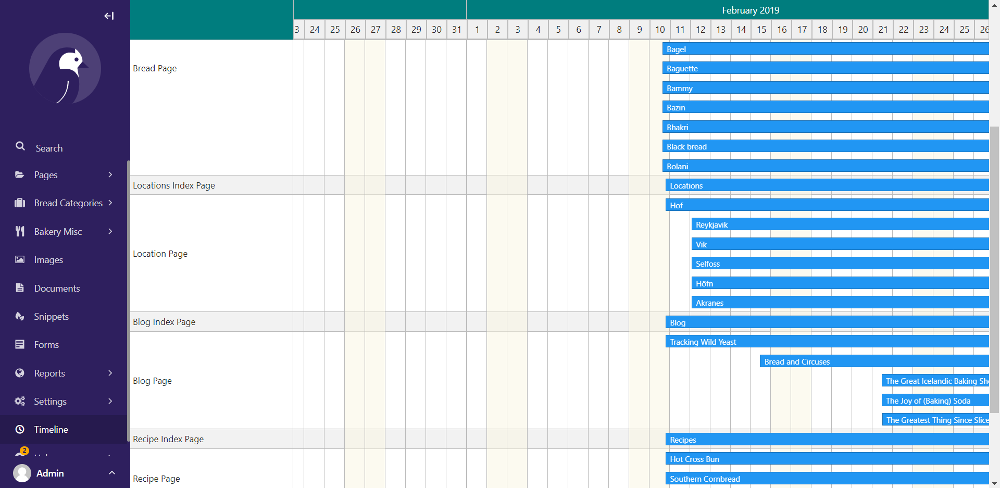

# Neurasal Technical Task
- Adding a React component to wagtail cms 

# Preview 

# Steps
1. First we used the bootstrapped version of wagtail called [BakeryDemo](https://github.com/wagtail/bakerydemo)
2. Developed the React component and then built the final result and added it in the static folder of our newly created django application called timeline
3. after that we then needed to import the built files in the template of our django application so that it can be shown in the admin panel of wagtail 

#  Launching steps
1. clone the repository `git clone https://github.com/amirNBK/neurasal-technical-task`
2. change the current directory `cd neurasal-technical-task`
3. create a virtualenv `python -m venv .env && source .env/bin/activate` ( or if you are in windows you can use `.env\Scripts\activate` to activate the virtualenv )
4. after activating the virtualenv we need to install the dependencies `pip install -r bakerydemo/requirements/development.txt`
5. this is the root of our application but the core app is inside of the bakerydemo folder
6. `cd ./bakerydemo`
7. there is no need to build the react components since they are already there for you
8. we need to create migrations `python manage.py makemigrations` 
9. apply the migrations `python manage.py migrate`
10. create the test data `python manage.py load_initial_data`
11. create a super user so that you can authenticate in the admin panel `python manage.py createsuperuser`
12. at last you can run the project using `python manage.py runserver` now you should have your backend server running in `localhost:8000`
13. you can access the admin panel using `localhost:8000/admin`
14. authenticate using the credentials you have set in the previous step ( or you can use default admin:changeme )
15. now you can access the timeline view from `localhost:8000/admin/timeline`
 
 **NOTE: if you don't have any data you did not create the test data refer to step 10**

 # Changing the front-end
 For that you can easily install the dependencies with `npm install`. keep in mind that we have a react project inside timeline/client folder so everything we talk about is happened inside that folder.
 you can run the project by `npm start` after that you need to make changes in the Timeline component. when you finished editing the component you must build and then copy the build folder in the static folder of bakery demo folder.

 Detailed documentation can be found at : [Original Post](https://dev.to/lb/adding-a-react-component-in-wagtail-admin-3e)

